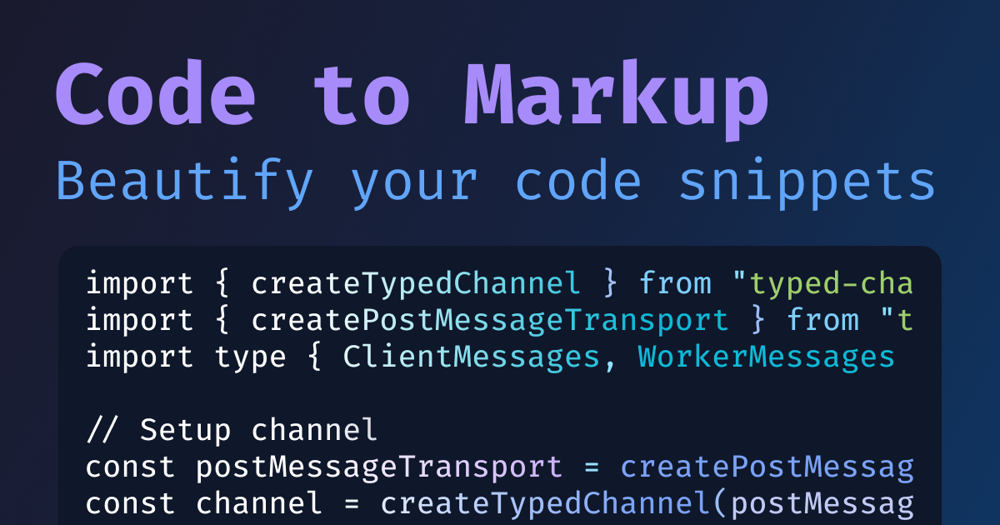

# Code to Markup

Convert your code snippets into beautifully highlighted HTML markup for static websites, blogs, and documentation. A powerful web tool that supports multiple syntax highlighters and themes.

## ✨ Features

- 🎨 **Multiple Syntax Highlighters**: Choose from Highlight.js, Prism.js, or Shiki
- 🌈 **Rich Theme Collection**: Dozens of beautiful themes for each highlighter
- 🔤 **Extensive Language Support**: Supports hundreds of programming languages
- 📋 **One-Click Copy**: Copy generated HTML markup with a single click
- 🔗 **Shareable URLs**: Share your highlighted code via URL with embedded code
- 💾 **Auto-Save**: Your preferences are automatically saved in local storage
- 📱 **Responsive Design**: Works perfectly on desktop and mobile devices
- ⚡ **Fast & Lightweight**: No server required - runs entirely in your browser

## 🚀 Live Demo

Try it now: [https://psd-coder.github.io/code-to-markup/](https://psd-coder.github.io/code-to-markup/)

## 🎯 Use Cases

- **Documentation**: Create beautiful code examples for your docs
- **Blog Posts**: Add syntax-highlighted code snippets to your articles
- **Static Websites**: Enhance your static site with professional code formatting
- **Presentations**: Generate HTML code blocks for web-based presentations
- **Email Templates**: Include formatted code in HTML emails
- **README Files**: Create examples for your GitHub repositories

## 🛠️ Supported Highlighters

### 1. **Highlight.js**

- 🎨 50+ themes
- 📚 190+ language definitions

### 2. **Prism.js**

- 🎨 8 core themes plus community themes
- 📚 200+ supported languages

### 3. **Shiki**

- 🎨 60+ themes
- 📚 220+ supported languages
- 🎁 Embeds styles directly in the generated HTML

## 🏗️ How It Works

1. **Select a Highlighter**: Choose from Highlight.js, Prism.js, or Shiki
2. **Pick a Theme**: Browse through dozens of beautiful themes
3. **Choose Language**: Select from hundreds of supported programming languages
4. **Paste Your Code**: Add your code snippet in the text area
5. **Copy Markup**: Get the generated HTML markup with a single click (for Highlight.js and Prism.js you have to add link to styles though)

## 📄 License

This project is licensed under the MIT License - see the [LICENSE](LICENSE) file for details.

## 🙏 Acknowledgments

- [Highlight.js](https://highlightjs.org/) - Syntax highlighting for the web
- [Prism.js](https://prismjs.com/) - Lightweight, extensible syntax highlighter
- [Shiki](https://shiki.style/) - Beautiful syntax highlighter
- [Alpine.js](https://alpinejs.dev/) - Lightweight JavaScript framework
